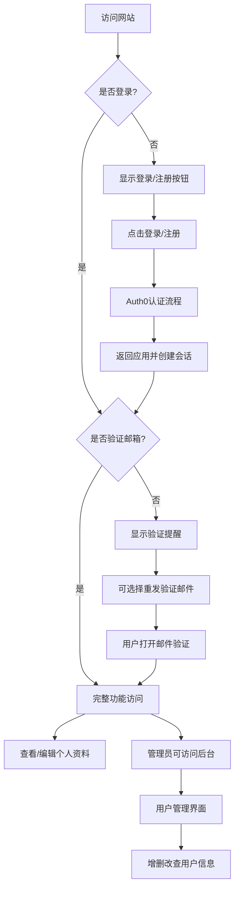

# Auth0 邮箱验证与用户管理系统

## 🌟 项目概述

本项目是一个基于 Flask 和 Auth0 身份验证服务的邮箱验证和用户管理系统。系统提供了完整的用户注册、登录、邮箱验证功能，以及管理员后台用于管理用户信息。

## 🛠️ 技术栈

- **后端**: Python 3.x、Flask 2.x
- **认证服务**: Auth0
- **前端**: HTML、Bootstrap 5
- **其他库**: Authlib、Requests、dotenv

## 📂 项目结构

```
Auth0-邮箱验证系统/
│
├── server.py              # 主应用程序入口
├── requirements.txt       # 项目依赖
├── .env                   # 环境变量配置
├── README.md              # 项目说明
│
├── templates/             # HTML模板
│   ├── home.html          # 首页模板
│   ├── profile.html       # 用户资料页面
│   └── admin.html         # 管理员界面
│
└── static/                # 静态资源文件
    ├── css/               # CSS样式文件
    └── js/                # JavaScript文件
```

## ✨ 核心功能

### 1. 用户认证

- 使用 Auth0 进行安全可靠的用户认证
- 支持多种登录方式（账号密码、社交账号等）
- 用户登出功能

### 2. 邮箱验证

- 新用户注册后自动发送验证邮件
- 在个人资料页显示邮箱验证状态
- 支持重新发送验证邮件
- 验证状态实时提示

### 3. 用户个人资料

- 查看个人资料信息
- 显示头像、姓名、邮箱等个人信息
- 显示账号相关信息（ID、更新时间等）

### 4. 管理员后台

- 用户列表查看
- 用户信息管理（增加、删除、编辑、查询）
- 用户账号状态管理

## 🔄 工作流程



## 🔧 安装与配置

### 前置条件

- Python 3.6+
- Auth0账号

### 安装步骤

1. **克隆仓库**
   ```bash
   git clone <仓库地址>
   cd <项目目录>
   ```

2. **安装依赖**
   ```bash
   pip install -r requirements.txt
   ```

3. **配置Auth0**
   - 在Auth0 Dashboard创建新应用
   - 配置回调URL: `http://localhost:4000/callback`
   - 配置登出URL: `http://localhost:4000`

4. **环境变量设置**
   创建或编辑`.env`文件:
   ```
   AUTH0_CLIENT_ID=你的客户端ID
   AUTH0_CLIENT_SECRET=你的客户端密钥
   AUTH0_DOMAIN=你的Auth0域名
   APP_SECRET_KEY=你的应用密钥
   ```

5. **运行应用**
   ```bash
   python server.py
   ```

6. **访问应用**
   在浏览器中访问 `http://localhost:4000`

## 🔐 管理员账户

- 在Auth0 Dashboard中设置特定用户为管理员
- 管理员可通过 `/admin` 路径访问管理界面
- 默认情况下，第一个注册的用户将被设置为管理员

## 📝 使用注意事项

- 此应用在生产环境中应使用HTTPS协议
- 保护好`.env`文件中的密钥信息
- 定期更新依赖以修复可能的安全漏洞

## 🔍 故障排除

- **邮件未收到**: 检查垃圾邮件文件夹，或使用"重新发送验证邮件"功能
- **登录失败**: 确认Auth0配置正确，并检查网络连接
- **管理员访问受限**: 确认用户在Auth0中被正确设置为管理员角色 